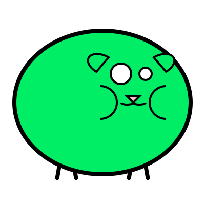
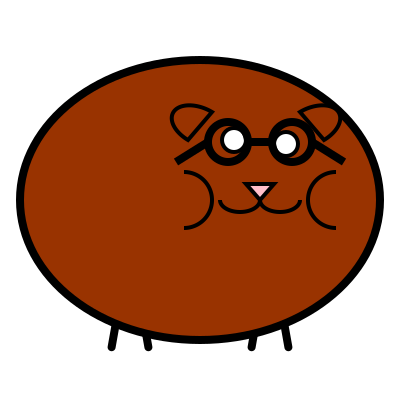

# hamicon

A small program to build randomized hamster icons.

They can be deterministcaly generated from a seed, so they can be used as user icons, or use random
ones as placeholders.

They are given in optimized-but-readable SVG format so they work for all sizes.

They come with class names on the different body parts that are tied to css animations.
So you can have them wiggle their nose by adding the `.wiggle` class to the `#nose` component.

## Examples

